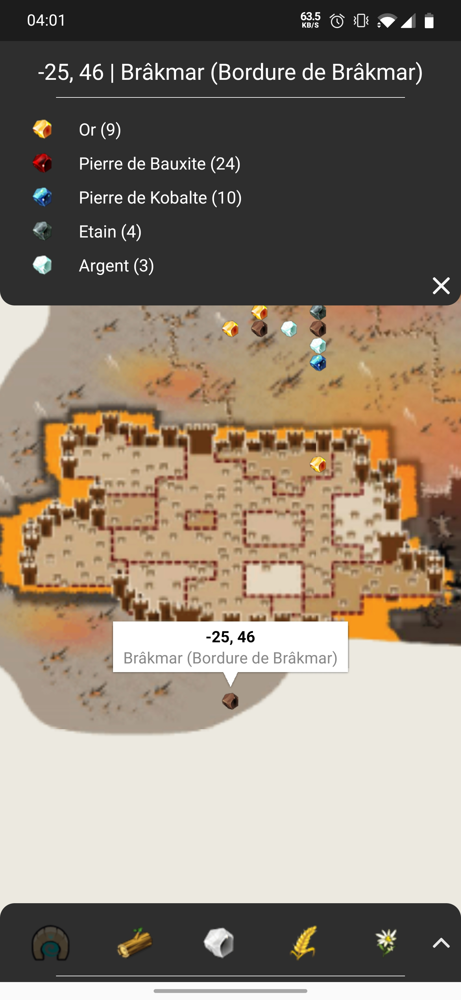
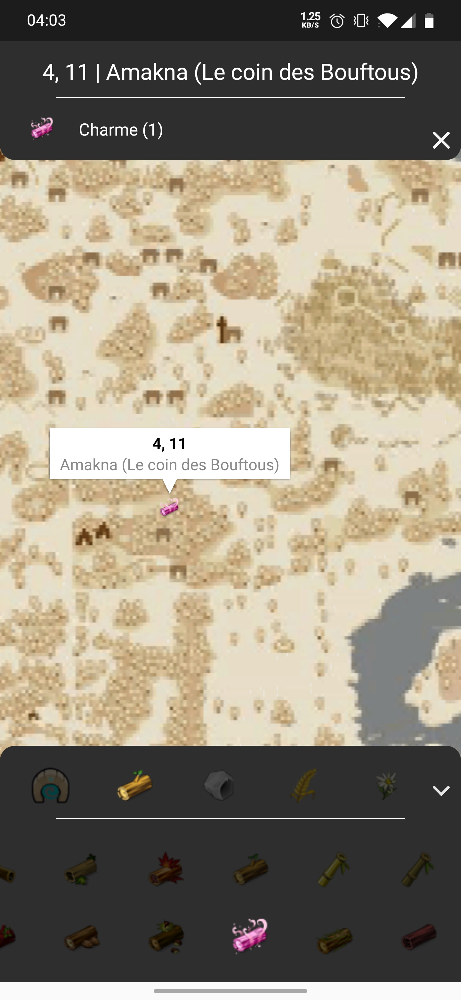

# Dofus Map

 

> Dofus Map est une application Android permettant d'accéder à une carte du jeu [Dofus Retro](https://www.dofus.com/fr/dofus-retro)

 

## Introduction

Cet outil permet de visualiser différentes localisation de lieux/ ressources du jeu Dofus Retro.

La plupart des images utilisées pour cette application sont l'oeuvre et la propriété d'[Ankama Studio](https://www.ankama.com/fr).

 

## Téléchargement/ Installation

Cette application est compatible avec les versions d'Android au dessus d'Oreo (8.0.0).

[Téléchargement du fichier APK](./readme/dofus-map.apk)

> Vérifier l'option d'installation des sources inconnus si vous télécharger directement depuis votre téléphone -> [tuto](https://www.frandroid.com/comment-faire/tutoriaux/184151_comment-installer-un-fichier-apk-sur-son-terminal-android)

Une fois le fichier sur votre téléphone, lancer l'apk depuis votre gestionnaire de fichiers pour lancer l'installation.

 

## Screenshots

  

## Contribution

Vous pouvez contribuer au projet de différentes façon:

- [Report de bug](https://github.com/AntoineAverlant/DofusMap/issues/new)
- [Demande d'amélioration](https://github.com/AntoineAverlant/DofusMap/issues/new)
- [Contribuer au code](https://github.com/AntoineAverlant/DofusMap/pulls):
  - Forker le projet
  - Créer une pull request
